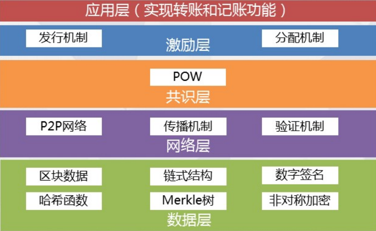
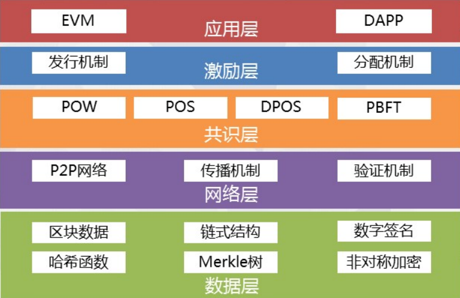
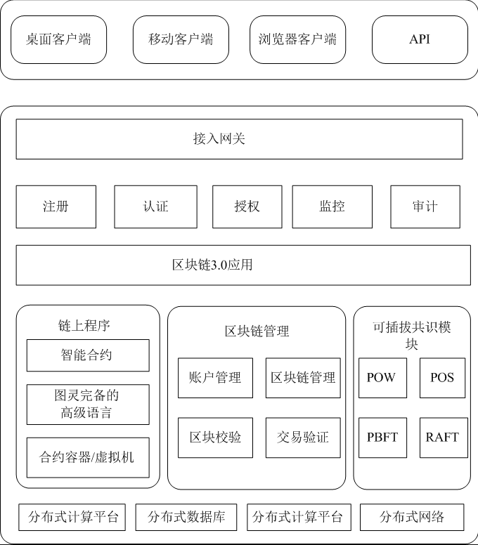

## 文章前言

本篇文章我们主要对公链审计中几个值得关注的方面进行简单介绍，对于安全审计人员以及公链开发人员而言这都是一个值得借鉴与思考的项目。

## 体系结构

在介绍公链体系建设之前我们先来看一下区块链的体系结构：

**区块链 1.0时代：**

体系架构：如下图所示

代表产物：比特币、瑞波币、狗狗币、莱特币、万事达币等

**区块链 2.0时代：**

体系结构：如下图所示

代表产物：以太坊、LISK、Hyperledger等

主要变更：

- 应用层：增加了智能合约
- 激励层：缩短出块时间为16秒
- 共识层：加入DPOS、POS、PBFT
- 数据层：扩充了区块，支持发送数据和变量，采用优化的加密算法和Merkle树

**区块链 3.0时代：**

体系结构：如下图所示

代表产物：EOS、VAR、AE、Asch、ELA、DFINITY

主要变更：区块链在金融行业之外的各行各业的应用场景，能够满足更加复杂的商业逻辑

## 安全建设

下面我们根据区块链的体系架构来分层对区块链公链的安全建设中值得思考的问题进行简单介绍，其中有约75%的问题曾引发公链安全问题，也是公链安全审计中值得关注的一些点，这里以提问的形式给出，以引起大家思考，如果想要进一步进行讨论可以直接在Issue中进行，欢迎大家参与：

### 数据层

数据层是最底层的技术，主要的功能为数据存储、账户和交易的实现与安全。数据存储主要基于Merkle树，通过区块的方式和链式结构实现，大多以KV数据库的方式实现持久化，例如：比特币和以太坊采用的LevelDB。

关于数据层值得我们思考的点有如下几个：

1. 公链区块数据结构设计是否合理？
2. 公链加密算法是否符合密码学要求？
3. Merkle Tree构建方式设计是否合理？
4. Merkle Tree节点CURD设计是否合理？
5. 公链区块时间戳校验逻辑设计是否合理？
6. 公链数据库数据存储与数据CURD安全性？
7. 公链私钥/助记词生成算法是否足够安全？
8. 公链私钥/助记词是否有进行加密存储？
9. 公链私钥/助记词是否存在滥用/内存残留？

### 网络层

网络层的主要目的是实现区块链网络节点之间的信息交互，区块链的本质是一个点对点(P2P)网络，每一个节点既能够接收信息，也能够生产信息，节点之间通过维护一个共同的区块链来保持通信。

在区块链的网络中，每一个节点都可以创造出新的区块，新区块被创造出以后，会通过广播的形式通知其他的节点，而其他节点反过来会对这个节点进行验证，当区块链网络中超过51%的用户对其验证通过以后，这个新的区块就会被添加到主链上。

关于网络层值得我们思考的点有如下几个：

1. 公链节点发现算法设计是否合理？
2. 公链节点增删改查设计是否合理？
3. 公链节点惩罚机制设计是否合理？
4. 公链节点通信协议设计是否合理？
5. 公链节点请求处理设计是否合理？
6. 请求处理数据包大小是否做限制？
7. 公链交易传播机制设计是否合理？
8. 公链区块数据同步机制是否合理？
9. 交易处理相关逻辑设计是否合理？

### 共识层

共识层能够让高度分散的节点在去中心化的系统中针对区块数据的有效性达成共识，每一个运行着的区块链都需要一个共识算法来保证出块的有效性和有序性，常见的共识算法有POW、POS、DPOS、POA、POC等。

关于共识层值得我们思考的点有如下几个：

1. 公链共识算法设计是否安全？
2. 公链共识验证设计是否合理？
3. 公链共识罚没设计是否合理？
4. 公链手续费用设计是否合理？
5. 公链挖矿相关设计是否合理？
6. 区块难度动态调整设计是否合理？
7. 区块难度检查逻辑设计是否合理？
8. 链重组、链重置、链分叉等处理设计？

### 激励层

公链激励层的目的是提供一定的激励措施来鼓励节点参与区块链的安全验证工作，并确保区块链生态的平衡和良性发展，在去中心化的共有链中，需要设定相应的奖励机制来激励遵守规则的参与记账节点，同时需要建立惩罚机制来惩罚不遵守规则的参与记账节点。区块链激励层将经济因素引入区块链技术体系，带来组织协作效率和生态内价值交换效率的提升，公链的激励机制是保证区块链良性循环发展的重要机制。

关于激励层值得我们思考的点有如下几个：

1. 公链发行机制设计是否合理？
2. 公链惩罚机制设计是否合理？

### 合约层

合约层封装区块链系统的各类脚本代码、算法以及由此生成的更为复杂的智能合约。如果说数据、网络和共识三个层次作为区块链底层“虚拟机”分别承担数据表示、数据传播和数据验证功能的话，合约层则是建立在区块链虚拟机之上的商业逻辑和算法，是实现区块链系统灵活编程和操作数据的基础。包括比特币在内的数字加密货币大多采用非图灵完备的简单脚本代码来编程控制交易过程，这也是智能合约的雏形，随着技术的发展，已经出现以太坊等图灵完备的可实现更为复杂和灵活的智能合约的脚本语言， 使得区块链能够支持宏观金融和社会系统的诸多应用。

关于合约层值得我们思考的点有如下几个：

1. 合约虚拟机安全设计？
2. 合约部署/执行/接口？
3. 智能合约相关安全性？

### 应用层

应用层封装了区块链的各种应用场景和案例，类似于计算机中的各种软件程序，是普通用户可以真正直接使用的产品，也可以理解为B/S架构的产品中的浏览器端(Browser)。

关于应用层值得我们思考的点有如下几个(仅公链而已，不涉及钱包APP/交易所/DEFI等)：

#### 账户相关

1. 钱包账户CRUD逻辑设计？
2. 钱包导入导出权限校验？
3. 钱包密码复杂度相关设计？
4. 钱包账户地址合法性校验？

#### RPC相关

1. 公链RPC接口是否需要外置公网？
2. 公链RPC接口权限是否明确划分？
3. 公链RPC接口是否有敏感类操作？
4. 公链RPC接口是否有做异常处理？
5. 公链RPC接口最大数据处理限制？
6. 公链RPC接口请求数据编码解码？
7. 公链RPC请求处理是否开启SSL?

#### 并发相关

1. 公链高并发请求处理设计？
2. 是否设置节点最大连接数？

1. 公链WebUI交互界面是否允许远程访问？
2. 公链WebUI交互界面是否存在Web类漏洞?
3. 公链WebUI交互界面是否允许本地存储密码信息？

### 代码层

公链中确实没有"代码层"这一说，这里笔者将其提出来主要是用于归类公链开发过程中可能需要考虑的问题：

1. 公链开发语言特性，例如：Go语言数据读取中的ReadAll()、append特性等
2. 公链开发语言版本，例如：Go语言某些版本存在远程命令执行
3. 公链开发规范编码，例如：空指针、切片、异常处理等操作
4. 公链加密解密处理，例如：未做长度检查的高复杂性编码解码
5. 数据类型转换处理，例如：HexToByte、Integer.parseInt()等
6. 基本业务逻辑设计，例如：无限的循环编码次数导致拒绝服务攻击

### 其他项

除了以上区块链架构层面值得思考的问题之外，还需要考虑一下安全问题：

#### 节点安全

1. 节点端数据存储是否加密？
2. 节点端文件权限是否合理？
3. 节点运行环境是否安全？
4. 节点是否非ROOT启动？
5. 节点端是否存在脆弱性Web服务？
6. 节点服务器端是否存在不安全的配置？
7. 节点服务器端是否存在未授权访问类漏洞？
8. 节点服务器端是否存在SSH账户密码泄露？

#### 算力攻击

1. 51%攻击
2. 公链硬分叉
3. 算力劫持(蠕虫感染矿机)

#### 第三方库

是否使用存在漏洞的第三方类库，例如：Jackson-databind、FastJSON等

#### 中间件类

使用使用存在漏洞的中间件，例如：低版本的Tendermint

#### 跨链需求

1. 跨链方式是否可靠以及合适？
2. 同构跨链&异构跨链实现方案？
3. 重复一遍上述小节的安全问题

## 项目维护

- Al1ex@Heptagram

## 参与讨论

直接在Issue中参与相关问题的讨论即可
