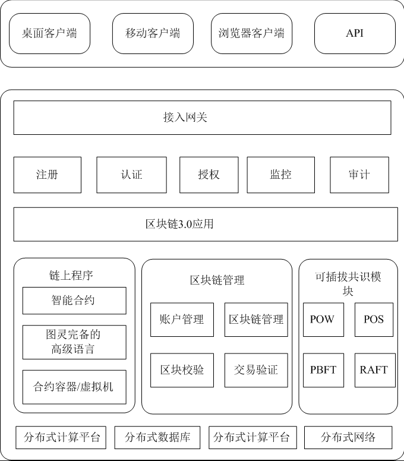

## Preface

In this article, we mainly introduce several aspects of public chain audit which are worthy of attention. For security auditors and public chain developers, this is a project worthy of reference and thinking.

## Architecture

Before introducing the construction of public chain system, let's take a look at the architecture of blockchain:

**Blockchain 1.0 era：**

Architecture: as shown in the figure below  

Representative products: bitcoin, reborn coin, dogcoin, Leyte coin, MasterCard coin, etc

**Blockchain 2.0 era：**

Architecture: as shown in the figure below  

Representative products: Ethereum, lisk, hyperledger, etc  

Major changes:

- Application layer: added smart contract  
- Excitation layer: shorten the block time to 16 seconds  
- Consensus layer: add dpos, POS, pbft  
- Data layer: expanded the block, support sending data and variables, using optimized encryption algorithm and Merkle tree

**Blockchain 2.0 era**

Architecture: as shown in the figure below

Representative products: EOS, VaR, AE, ash, ELA, dfinity

Main changes: the application scenarios of blockchain in all walks of life outside the financial industry can meet more complex business logic

## Sec Construction

Next, we will give a brief introduction to the problems worthy of consideration in the security construction of the blockchain public chain according to the architecture of the blockchain. About 75% of the problems have caused public chain security problems, which are also some points worthy of attention in the public chain security audit. Here, we give them in the form of questions to arouse our thinking, If you want to have a further discussion, you can do it directly in issue：

#### Data layer

Data layer is the bottom layer technology, and its main functions are data storage, account and transaction implementation and security. Data storage is mainly based on Merkle tree, which is realized by block and chain structure. Most of them are persistent by kV database, such as bitcoin and leveldb adopted by Ethereum.  

The data layer is worth thinking about as follows:

1. Is the data structure design of public chain block reasonable?  
2. Does the public chain encryption algorithm meet the requirements of cryptography?  
3. Is the design of Merkle tree reasonable?  
4. Is the CRUD design of Merkle tree node reasonable?  
5. Is the design of public chain block timestamp verification logic reasonable?  
6. Public chain database data storage and data CURD security?  
7.  Is the public key/mnemonic generation algorithm secure enough?  
8. Is public key/mnemonics encrypted?  
9. Is there any abuse/memory residue in public key/mnemonics?

#### Network layer

The main purpose of the network layer is to realize the information interaction between the nodes of the blockchain network. The essence of the blockchain is a peer-to-peer (P2P) network. Each node can receive information and also produce information. The nodes maintain communication by maintaining a common blockchain.  In the blockchain network, each node can create a new block. After the new block is created, other nodes will be notified by broadcasting. In turn, other nodes will verify the node. When more than 51% of the users in the blockchain network pass the verification, the new block will be added to the main chain.  

There are several points worth thinking about the network layer

1. Is the design of public chain node discovery algorithm reasonable?
2. Is the design of public chain nodes reasonable?

3. Is the design of punishment mechanism reasonable?

4. Is the design of communication protocol reasonable?

5. Is the request processing design of public chain node reasonable?

6. Is there a limit on the size of the request processing packet?

7. Is the design of public chain transaction communication mechanism reasonable?

8. Is the block data synchronization mechanism reasonable?

9. Is the logic design of transaction processing reasonable?

#### Consensus layer

The consensus layer enables highly dispersed nodes to reach a consensus on the effectiveness of block data in a decentralized system. Every running blockchain needs a consensus algorithm to ensure the effectiveness and order of block output. Common consensus algorithms include pow, POS, dpos, Poa, POC, etc.

On the consensus level, we should consider the following points：

1. Is the design of public chain consensus algorithm safe?
2. Is the design of public chain consensus verification reasonable?

3. Is the design of public chain consensus forfeiture reasonable?

4. Is the design of public chain service fee reasonable?

5. Is the design of public chain mining reasonable?

6. Is the block difficulty dynamic adjustment design reasonable?

7. Is the logic design of block difficulty check reasonable?

8. Design of chain reorganization, chain reset, chain bifurcation, etc?

#### Incentive layer

The purpose of the public chain incentive layer is to provide certain incentive measures to encourage nodes to participate in the security verification of the blockchain, and to ensure the balance and healthy development of the blockchain ecology. In the decentralized common chain, it is necessary to set up the corresponding incentive mechanism to encourage the participating accounting nodes who comply with the rules, and establish the punishment mechanism to punish the participating accounting nodes who do not comply with the rules. The incentive layer of blockchain introduces economic factors into the blockchain technology system, which improves the efficiency of organizational cooperation and value exchange within the ecology. The incentive mechanism of public chain is an important mechanism to ensure the virtuous development of blockchain.

There are several points worthy of our consideration about the incentive level

1. Is the design of public chain issuing mechanism reasonable?

2. Is the design of public chain punishment mechanism reasonable?

#### Contract layer

The contract layer encapsulates all kinds of script codes and algorithms of the blockchain system, as well as the more complex smart contracts generated from them. If the three levels of data, network and consensus, as the underlying "virtual machine" of the blockchain, respectively undertake the functions of data representation, data dissemination and data verification, the contract layer is the business logic and algorithm based on the blockchain virtual machine, which is the basis for realizing the flexible programming and data operation of the blockchain system. Most digital cryptocurrencies, including bitcoin, use non Turing complete simple script code to program and control the transaction process, which is also the rudiment of smart contract. With the development of technology, there are Turing complete script languages such as Ethereum that can realize more complex and flexible smart contract, Blockchain can support many applications of macro financial and social systems.

We should consider the following points about the contract layer:

1. Contract virtual machine security design?
2. Contract deployment / execution / interface?

3. Security related to smart contract?

#### Application layer

The application layer encapsulates various application scenarios and cases of blockchain, which is similar to various software programs in computers. It is a product that ordinary users can really use directly, and it can also be understood as the browser of B / S architecture products.

We should consider the following points about the application layer (only public chain, not wallet App/Exchange/DEFI, etc.):

##### Account related

1. CRUD logic design of wallet account?
2. Check the import and export permission of wallet?

3. Design of wallet password complexity?

4. Check the validity of wallet account address?

##### RPC related

1. Does the public RPC interface need an external public network?
2. Is the public chain RPC interface authority clearly divided?

3. Does the public RPC interface have sensitive class operations?

4. Does the public RPC interface handle exceptions?

5. The maximum data processing limit of public chain RPC interface?

6. Public chain RPC interface requests data encoding and decoding?

7. Is SSL enabled for public chain RPC request processing?

##### Concurrency related

1. Design of high concurrency request processing in public chain?
2. Set the maximum number of connections?

3. Does the public Chain Web UI interface allow remote access?

4. Is there a web class vulnerability in the public chain webui interface?

5. Is the public chain webui interface allowed to store password information locally?

#### Code layer

It is true that there is no "code layer" in the public chain. Here, the author proposes it mainly to classify the problems that may need to be considered in the process of public chain development:

1. Common chain development language features, such as readall (), append features in go language data reading
2. Public chain development language version, for example, some versions of go language have remote command execution

3. Public chain development specification coding, such as null pointer, slicing, exception handling and other operations

4. Public chain encryption and decryption processing, such as high complexity encoding and decoding without length check

5. Data type conversion processing, such as hextobyte, integer. Parseint(), etc

6. Basic business logic design, for exam

#### Other items

In addition to the above issues worthy of consideration at the level of blockchain architecture, we also need to consider the following security issues:

##### Node security

1. Is the data storage encrypted?
2. Is the file permission reasonable?

3. Is the running environment safe?

4. Is the node not root started?

5. Is there a vulnerable web service on the node side?

6. Is there any unsafe configuration on the server side of the node?

7. Is there an unauthorized access vulnerability on the server side of the node?

8. Is the SSH account password leaked on the server side of the node?

##### Computing power attack

1. 51% attack
2. Hard bifurcation of common chain

3. Computing hijacking (worms infect mining machines)

##### Third party Library

Whether to use the third-party libraries with vulnerabilities, such as Jackson databind, fastjson, etc

##### Middleware 

Use vulnerable middleware, such as the lower version of tendermint

##### Cross chain demand

1. Is the cross chain mode reliable and appropriate?
2. Isomorphic cross chain & heterogeneous cross chain implementation scheme?

3. Repeat the safety issues in the above section

## Maintenance

- Al1ex@Heptagram

## Discussion

Directly participate in the discussion of related issues in issue